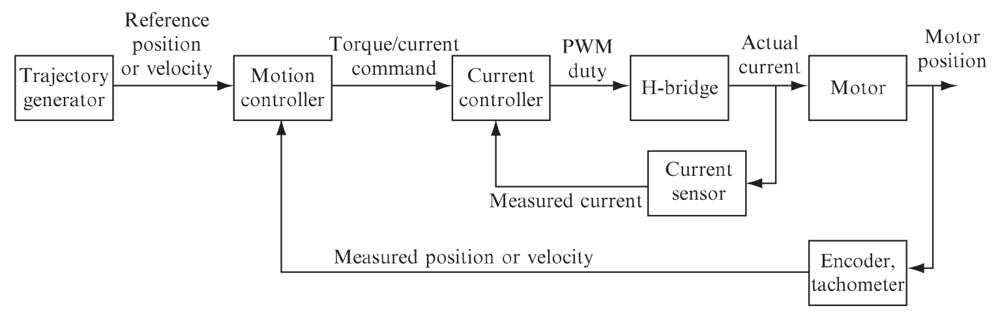

# DC Motor Control Project
Final project for ME 333: Introduction to Mechatronics, Northwestern University, Winter 2019.

## Overview
This project consisted of building a circuit that uses a PIC32 microcontroller to control the position and behavior of a brushless DC motor. 

## Hardware
A PIC32MX795F512H chip was mounted on a board (called the "NU32" Development Board) that included buttons, LEDs, breakout ports, a USB port, and a virtual USB serial port. The motor used a rotary encoder to measure its angular position and the PIC32 microcontroller communicated through SPI with an encoder counting chip that counted the number of rotary encoder lines the motor turned each time. A MAX9918 current-sense amplifier provided voltage proportional to the motor current and this voltage output was attached to an ADC input on the NU32. Finally, a DRV8835 H-bride board was used to control the motor and was attached to a digital output channel as well as a PWM output compare channel on the NU32. Here is a general block diagram for the motion control of the system:
 
 

## Motor Interface
A MATLAB client was used to interface with the motor circuit and give it commands to acquire information (such as controller gains) and execute tasks (such as move to a specified angle). The full list of commands is below:
 
 

## Demo

